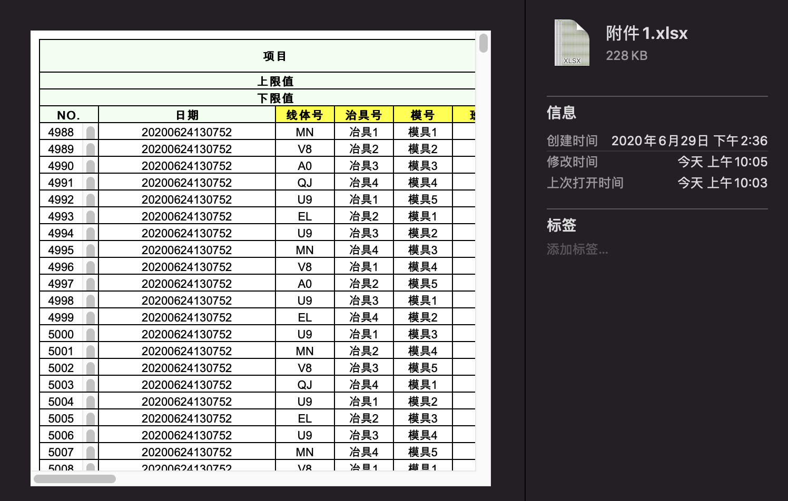

# 普创智控线上实测

使用 Vue 构建单页面应用，主要实现以下功能：

- 通过上传 xlsx 文件导入源数据，以供下一步处理。（xlsx 文件见附件）
  
  文件内容说明：

  - 该文件为工厂设备生产数据的一个小样本，数据来源于设备对某种产品的各项指标的检测。
  - 其中`项目`为产品的检测项目，`上下限`数据则对应检测项目的合格值区间，超出该区间的检测结果为`NG`，否则为`OK`。
  - 其中数据的每一行代表一个产品的检测数据，每个产品都有`NO.`、`生产时间`、`线体号`、`冶具号`、`模具号`、`班别`及各检测项目的数据。

- 以列表的形式展示各项目，列表项包括名称、上下限和良率（`OK/(NG+OK)`），可以对项目做删除、搜索、修改，查看详情。

- 项目详情页，使用 Echarts 框架，绘制图形

  - 绘制各项目的良率饼图（尽量美观）
  - 绘制良率柱状图，要求如下：

    - X 轴属性可选，例如，选择生产时间，则绘制不同时间的良率柱状图。
    - 可排序，按照良率大小排序，顺序可选。
    - 图形尽量美观。

  - 绘制良率折线图，要求如下：
    - X 轴属性可选，并且提供分组属性，这样可以在图形上呈现多条折线。
    - 图形尽量美观。

- 合理组织页面结构，路由跳转。
